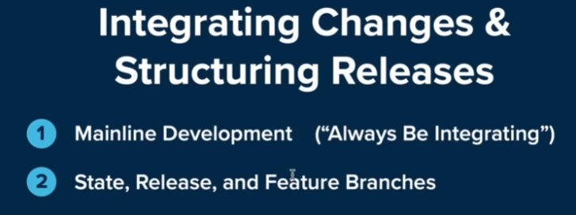
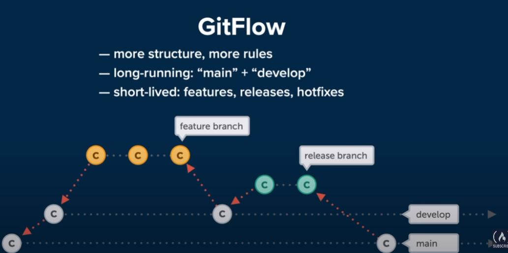
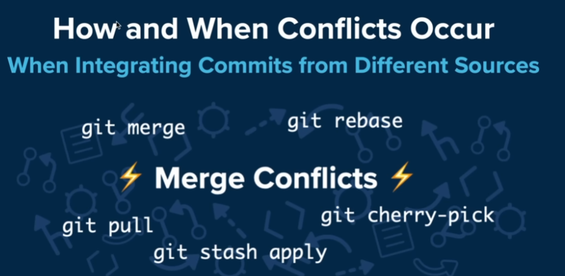

# Git BEST PRACTICES

## CONFIRMACIONES
Al realizar una correcta confirmación, tenemos q tener en cuenta que cambios son los que queremos incorporar, y en sugundo lugar, redactar un buen mensaje de confirmacion.

Las confirmaciones tienen que tener sentido, y que solo incluyan cambios de un solo tema.


Esto seria un ejemplo de una buena confirmacion, porque separa diferentes temas. Si añaden todos los temas juntos, puede ser dificil de entender en un futuro.


O incluso podemos agrgar un archivo y parte de otro, para una confirmacion, y dejar el otro para futuras confirmaciones.

### Visualizar los cambios

Podemos ver todos los cambios realizados con el "git status".

```
 git status
On branch master

No commits yet

Untracked files:
  (use "git add <file>..." to include in what will be committed)
        README.md
        image-1.png
        image.png
        index.html
        script.js
        style.css

nothing added to commit but untracked files present (use "git add" to track)
```

Utilizando el "git add <<<nombre del archivo>>>", podemos incorporar los cmabios solo de ese archivo.

Tambien podemos ver las comparaciones de los cambios que se han realizado.

```
git diff --staged
```

Podemos comparar los cambios en los archivos que se realizaron cambios y se han incorpordado al STAGE AREA.

O mas bien, realizar cambios linea por separado de un mismo archivo en el STAGE AREA.

```
$ git add -p
diff --git a/index.html b/index.html
index 69b7728..24eaf6a 100644
--- a/index.html
+++ b/index.html
@@ -7,7 +7,8 @@
     <link rel="stylesheet" href="style.css">
 </head>
 <body>
-    <h1 class="title">GIT FOR PROS and begginers</h1>
+    <div class="container"><h1 class="title">GIT FOR PROS and begginers</h1></div>
+
     <script src="script.js"></script>
 </body>
 </html>
\ No newline at end of file
(1/1) Stage this hunk [y,n,q,a,d,e,?]?

```

Asi, GIT va a recorrer cada uno de los cambios, y nos hace una simple pregunta... "¿Queremos agregar este trozo al cambio?", lo cual la respuesta puede ser SI O NO, las demas respuestas pueden no sernos utiles.

Si hacemos un "STATUS" podemos ver ese TROZO para ser confirmado.

```
 git status
On branch main

No commits yet

Changes to be committed:
  (use "git rm --cached <file>..." to unstage)
        new file:   index.html

Untracked files:
  (use "git add <file>..." to include in what will be committed)
        README.md
        image-1.png
        image.png
        script.js
        style.css

```

### COMMITS

Los mensajes deben ser concisos, menos de 80 caracteres si es preciso, debe ser un resumen muy breve de lo q paso. Si hay mucho contenido, eso quiere decir que incluimos demasiados temas en esa confirmacion.

### BRANCHING STRATEGIES

GIT nos proporciona las herramientas para trabajar con las ramas, pero el equipo de trabajo son los responsables de utilizarla de manera óptima.


Al trabajar con RAMAS, hablamos de como integramos los cambios y estructuramos las versiones.



Siempre integremos nuestro trabajo con el trabajo del equipo.

Al tener una sola RAMA, los cambios son incorporados directamente al codigo de producción, esto puede traer riesgos, las pruebas y los estandares de control deben ser de primera categoría.


En el otro extremo tenemos multiples tipos de RAMAS estan en el proyecto.


Los difentes flujos estan separados, es un poco mas complicado que el anterior modo, pero es cuestion ed tenerlo en practica.

Aca podemos encontrarnos con RAMAS DE LARGA EJECUCION, o llamadas MAIN o MASTER, o tambien pueden estar las de DEVELPMENT, PRODUCTION, etc. Lo q tienen en comun estas RAMAS, es q existen durante todo el ciclo de vida del proyecto.

El codigo debe pasar por pruebas y diferentes estados antes que llegue a produccion.

Entre las RAMAS de vida corta, son las que se crean para ciertos propósitos, luego se eliminan cuando han sido integradas.

## Flujo de GITHUB

Aboga por un flujo de trabajo que sea simple y eficiente.


Solo tiene una unica rama de ejecución prolongada, la RAMA MAIN, cualquier cosa en la q se este trabajando se realiza en una RAMA separada (corta), ya sea una actualización, una corrección de errores o una factorización.

### GIT FLOW



Ofrece mas estructura, pero también mas reglas a seguir, la RAMA principal, es la MAIN, la otra de larga duración se llama DEVELOP, todas las demas RAMAS mas cortas que comiencen en esta RAMA, tambien se fusionaran a ella.


## Pull Request


Son una forma de comunicarce con el codigo y revisarlo, sin un PR, los cambios se fusionarian en el codigo principal o en alguna otra RAMA, esto podria estar bien, pero el PR nos permite tener un segundo par de ojos.


Otro gran uso de los PR, son las bufurcaciones o FORKS


Vamos hacer un FORK del repositorio de RUBY ON RAILS, luego lo clonamos y finalmente creamos una nueva RAMA.

```
 git branch test

 git checkout test
```
Ya estamos ubicados en esta nueva RAMA, que se llama "test". Hacemos un pequeño cambio en algun archivo, y luego vemos los estados:

```
 git status
On branch test
Changes not staged for commit:
  (use "git add <file>..." to update what will be committed)
  (use "git restore <file>..." to discard changes in working directory)
        modified:   README.md

no changes added to commit (use "git add" and/or "git commit -a")
```
Ahora, ponemos este cambio en el STAGED AREA y hacemos el COMMIT. Todo esto quedaria registrado en una RAMA separada.

```
 git push --set-upstream origin test
Enumerating objects: 5, done.
Counting objects: 100% (5/5), done.
Delta compression using up to 6 threads
Compressing objects: 100% (3/3), done.
Writing objects: 100% (3/3), 310 bytes | 310.00 KiB/s, done.
Total 3 (delta 2), reused 0 (delta 0), pack-reused 0
remote: Resolving deltas: 100% (2/2), completed with 2 local objects.
remote:
remote: Create a pull request for 'test' on GitHub by visiting:
remote:      https://github.com/RadamantiumX/rails/pull/new/test
remote:
To https://github.com/RadamantiumX/rails.git
 * [new branch]            test -> test
branch 'test' set up to track 'origin/test'.
```
Hacemos un PUSH **corriente arriba** o "--set-upstream". Con esto hemos creado los cambios que podemos solicitar que se incluyan en el repositorio remoto, a traves del PR.


Esto nos aparece en el repositorio que BIFURCAMOS. Nos pregunta si queremos realizar el PR a la RAMA MAIN, esto lo podran ver los desarrolladores del repositorio original, donde analizaran los cambios y decidir si integrarlos o no.

## Merge Conflicts

Esto ocurre cuando el MERGE cambia desde una fuente diferente, o también, podria decirce de las siguientes formas:



GIT, generalmente puede resolver las tareas por si solo, pero hay situacion en las cuales se realizaron cambios contradictorios, aca es donde no puede decidir donde esta lo correcto.


Aca vemos que se cambia la misma linea en dos RAMAS diferentes, o un archivo se modifico en una RAMA y se elimino en otra. El problema es el mismo, los cambios se contradicen.


Es una forma de lidiar con un conflicto de MERGE. No necesariamente tenemos que resolverlo, tambien podemos desahacerlo.

